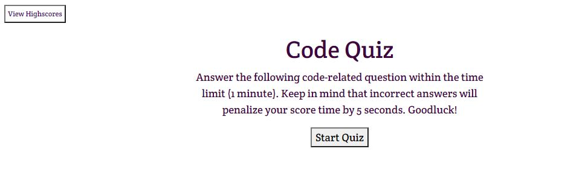

# 04 Web APIs: Code Quiz

## Description

The Code Quiz is based on 5 coding multiple choice questions.
The user is given 1 minute to complete the task. When a correct answer is selected, the user is given 5 added seconds to remaining time. If user select the incorrect question, 20 points are deducted (per wrong question) as well as 5 seconds from the remaining time.  

## Mock-Up

Below is a preview.

## Repository Link

https://github.com/jannverduzco/code-quiz

## Live Link

https://jannverduzco.github.io/code-quiz/